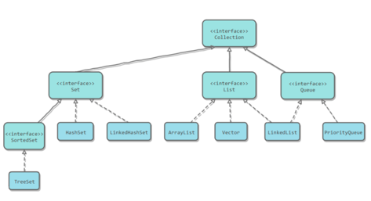

[TOC]

# 一、容器概述
容器主要分为Collection和Map两种，Collection是对象的集合，而Map是存储着键值对（两个对象）的映射表。  

## Collection
Collection是对象的集合，继承了Iterable。

### 1.List
- ArrayList：底层基于动态数组实现，支持随机访问。
- LinkedList：底层基于双向链表实现。一般可以用作双向队列
- Vector：底层基于数组实现，是线程安全的List，里面方法都用synchronized修饰。（[Vector一定线程安全吗？](https://note.youdao.com/)）